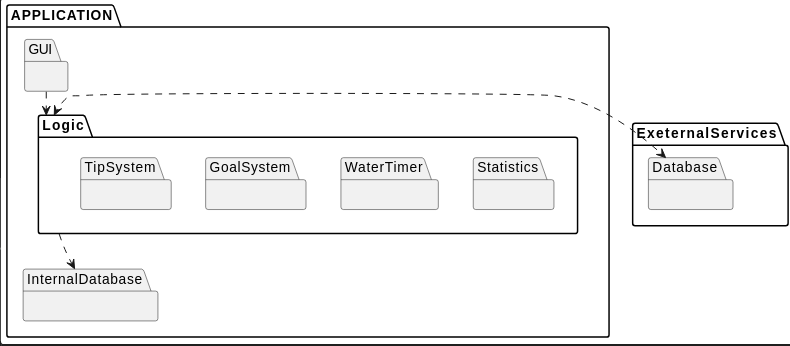

# _[your product name]_ Development Report

Welcome to the documentation pages of the _[your product name]_!

You can find here details about the _[your product name]_, from a high-level vision to low-level implementation decisions, a kind of Software Development Report, organized by type of activities: 

* [Business modeling](#Business-Modelling) 
  * [Product Vision](#Product-Vision)
  * [Features and Assumptions](#Features-and-Assumptions)
  * [Elevator Pitch](#Elevator-pitch)
* [Requirements](#Requirements)
  * [User stories](#User-stories)
  * [Domain model](#Domain-model)
* [Architecture and Design](#Architecture-And-Design)
  * [Logical architecture](#Logical-Architecture)
  * [Physical architecture](#Physical-Architecture)
  * [Vertical prototype](#Vertical-Prototype)
* [Project management](#Project-Management)

Please contact us!

Thank you!

### Team Members
Duarte Ribeiro Lagoela - up202205629@up.pt
Gonçalo Joaquim Vale Remelhe - up202205318@up.pt
José António Santos Costa - up202004823@up.pt
Rafael Costa Pires - up202208602@up.pt
Sara Isabel Borges da Silva - up202007248@up.pt

---
## Business Modelling

### Product Vision

For environmentally conscious individuals who aim for a sustainable lifestyle. WaterXPTO provides real-time monitoring, personalized insights, and actionable tips to reduce water consumption effortlessly. Track usage, receive tailored recommendations, and contribute to global conservation efforts with WaterXPTO.

### Features and Assumptions

#### Real-time Water Usage Tracking:
- Enable users to input and track their water usage data manually (via timer).

#### Personalized Water Usage Insights:
- Analyze users' water consumption patterns to provide personalized insights (potential areas for improvement).
- Display daily, weekly, and monthly usage history and trends in an easy-to-understand graphical format.

#### Water Saving Tips and Recommendations:

- Offer a library of water-saving tips and recommendations (based on users' usage patterns) (daily tips notification).

#### Notifications and Reminders:

- Send push notifications and reminders to users based on their water usage habits and conservation goals (timers when showring, washing dishes ...).
- Allow users to customize notification settings based on their preferences.

#### Water Conservation Challenges:

- Create challenges and competitions within the app to motivate users to save water.
- Allow users to join challenges, track their progress, and compete with friends or other users.

#### Feedback and Reporting:

- Implement a feedback mechanism within the app for users to submit suggestions, report issues, and provide overall feedback on their experience.

### Elevator Pitch
Draft a small text to help you quickly introduce and describe your product in a short time (lift travel time ~90 seconds) and a few words (~800 characters), a technique usually known as elevator pitch.

Take a look at the following links to learn some techniques:
* [Crafting an Elevator Pitch](https://www.mindtools.com/pages/article/elevator-pitch.htm)
* [The Best Elevator Pitch Examples, Templates, and Tactics - A Guide to Writing an Unforgettable Elevator Speech, by strategypeak.com](https://strategypeak.com/elevator-pitch-examples/)
* [Top 7 Killer Elevator Pitch Examples, by toggl.com](https://blog.toggl.com/elevator-pitch-examples/)

## Requirements

### User stories

- `As a User`, `I want` to track my daily water usage in real-time `so that` I can become more aware of my consumption habits and make informed decisions to reduce waste.

- `As a User`, `I want` to receive a statistical analysis about my water consumption patterns, `so that` I can improve my water consumption habits.

- `As a User`, `I want` to set personalized water usage goals and targets and receive notifications when I meet or exceed these targets, `so that` I can stay motivated to save water.

- `As a User`, `I want` to receive tips and recommendations for reducing water consumption in various areas of my daily life, `so that` I can learn new methods to reduce my water consumption.

- `As a User`, `I want` to receive notifications and reminders to take shorter showers, and perform other water-saving actions, `so that` I can stay on track with my conservation efforts.

- `As a Registered User`, `I want` to participate in water conservation challenges with friends and other users `so that` we can motivate each other and celebrate our collective efforts in saving water.

- `As a User`, `I want` to compare my water usage with regional or national averages `so that` I understand how my consumption habits compare to others and gain motivation to further reduce my environmental impact.

- `As an Unregistered User`, `I want` to be able to have access to most of the app’s features `so that` I don’t have to login.

- `As an Unregistered User`, `I want` to be able to create an account `so that` I can keep data on multiple devices.

### Domain Model

Each user can set as many goals as he wants and recieve different tips. Also, an user can register an activity and time its duration.

## Architecture and Design
The architecture of a software system encompasses the set of key decisions about its overall organization. 

A well written architecture document is brief but reduces the amount of time it takes new programmers to a project to understand the code to feel able to make modifications and enhancements.

To document the architecture requires describing the decomposition of the system in their parts (high-level components) and the key behaviors and collaborations between them. 

In this section you should start by briefly describing the overall components of the project and their interrelations. You should also describe how you solved typical problems you may have encountered, pointing to well-known architectural and design patterns, if applicable.

### Logical architecture

### Physical architecture
The goal of this subsection is to document the high-level physical structure of the software system (machines, connections, software components installed, and their dependencies) using UML deployment diagrams (Deployment View) or component diagrams (Implementation View), separate or integrated, showing the physical structure of the system.

It should describe also the technologies considered and justify the selections made. Examples of technologies relevant for ESOF are, for example, frameworks for mobile applications (such as Flutter).

Example of _UML deployment diagram_ showing a _deployment view_ of the Eletronic Ticketing System (please notice that, instead of software components, one should represent their physical/executable manifestations for deployment, called artifacts in UML; the diagram should be accompanied by a short description of each node and artifact):

### Vertical prototype
To help on validating all the architectural, design and technological decisions made, we usually implement a vertical prototype, a thin vertical slice of the system integrating as much technologies we can.

In this subsection please describe which feature, or part of it, you have implemented, and how, together with a snapshot of the user interface, if applicable.

At this phase, instead of a complete user story, you can simply implement a small part of a feature that demonstrates thay you can use the technology, for example, show a screen with the app credits (name and authors).

## Project management
Software project management is the art and science of planning and leading software projects, in which software projects are planned, implemented, monitored and controlled.

In the context of ESOF, we recommend each team to adopt a set of project management practices and tools capable of registering tasks, assigning tasks to team members, adding estimations to tasks, monitor tasks progress, and therefore being able to track their projects.

Common practices of managing iterative software development are: backlog management, release management, estimation, iteration planning, iteration development, acceptance tests, and retrospectives.

You can find below information and references related with the project management in our team: 

* Backlog management: Product backlog and Sprint backlog in a [Github Projects board](https://github.com/orgs/FEUP-LEIC-ES-2023-24/projects/64);
* Release management: [v0](#), v1, v2, v3, ...;
* Sprint planning and retrospectives: 
  * plans: screenshots of Github Projects board at begin and end of each iteration;
  * retrospectives: meeting notes in a document in the repository;
 
