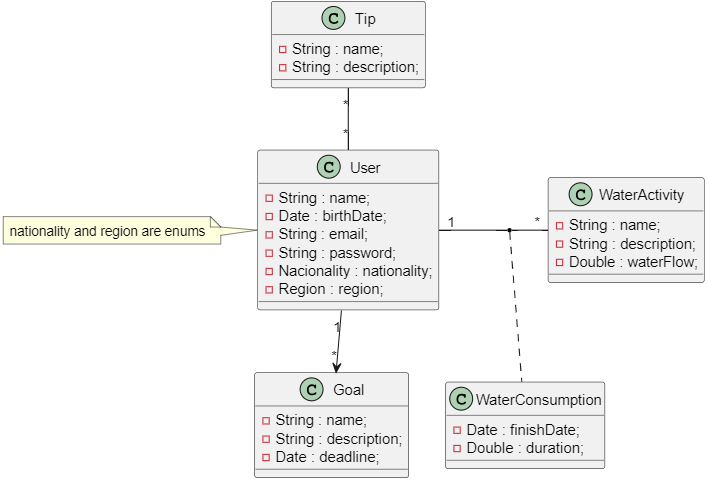

# Brainstorm Ideas
## Water-Tracker App:
- **personalized water usage goals**: Allow users to set personalized water usage goals and track their progress

- **Water Usage Insights**: Provide users with insights into their water usage patterns, including peak usage times, areas of high water consumption (e.g., showering, watering plants)

- **Interactive Water Saving Tips**: Offer users interactive tips and suggestions on how to save water in their daily activities

- **Water Impact Calculator**: Calculate the environmental impact of the water users waste based on their usage habits. For example, the app could show a comparison with water needs in Africa etc. `?`

- **Social Features**: Leaderboard, sharing acheivements etc...

- **Localized Water Conservation Tips (If we want to introduce complexity to the app)**: introduce localized water saving tips depending on the geographic location and local water issues (ex.: user do alentejo recebe informações acerca da escassez de água na regiao ao contrario de user em regiao que nao seja de zona de seca `?`)

### Project Vision Template

- "**FOR** environmentally conscious individuals **WHO** aim for a sustainable lifestyle. [App Name] provides real-time monitoring, personalized insights, and actionable tips to reduce water consumption effortlessly. Track usage, receive tailored recommendations, and contribute to global conservation efforts with [App Name].

### Functionalities

#### Real-time Water Usage Tracking:
- Enable users to input and track their water usage data manually (via timers `?`).

#### Personalized Water Usage Insights:
- Analyze users' water consumption patterns to provide personalized insights (potential areas for improvement).
- Display daily, weekly, and monthly usage history and trends in an easy-to-understand graphical format.

#### Water Saving Tips and Recommendations:

- Offer a library of water-saving tips and recommendations ( based on users' usage patterns `?`) (daily tips notification).

#### Notifications and Reminders:

- Send push notifications and reminders to users based on their water usage habits and conservation goals (timers when showring, washing dishes ... `?`).
- Allow users to customize notification settings based on their preferences.

#### Water Conservation Challenges `?`:

- Create challenges and competitions within the app to motivate users to save water.
- Allow users to join challenges, track their progress, and compete with friends or other users.

#### Feedback and Reporting:

- Implement a feedback mechanism within the app for users to submit suggestions, report issues, and provide overall feedback on their experience.

### User-Stories

- `As a User`, `I want` to track my daily water usage in real-time `so that` I can become more aware of my consumption habits and make informed decisions to reduce waste.

- `As a User`, `I want` to receive a statistical analysis about my water consumption patterns, `so that` I can improve my water consumption habits.

- `As a User`, `I want` to set personalized water usage goals and targets and receive notifications when I meet or exceed these targets, `so that` I can stay motivated to save water.

- `As a User`, `I want` to receive tips and recommendations for reducing water consumption in various areas of my daily life, `so that` I can learn new methods to reduce my water consumption.

- `As a User`, `I want` to receive notifications and reminders to take shorter showers, and perform other water-saving actions, `so that` I can stay on track with my conservation efforts.

- `As a Registered User`, `I want` to participate in water conservation challenges with friends and other users `so that` we can motivate each other and celebrate our collective efforts in saving water.

- `As a User`, `I want` to compare my water usage with regional or national averages `so that` I understand how my consumption habits compare to others and gain motivation to further reduce my environmental impact.

### Domain Model

#### Description
-**User**: user data;

-**Tip**: set of tips to inform the users;

-**Goal**: keep track of user goals;

-**Water Activity**: different water activities and their respective average water flow (ex: showering, 9L per minute);

-**Water Consumption**: record water consumptions for analysis (ex: John watered the plants for 30 minutes on 18/03/2024);

