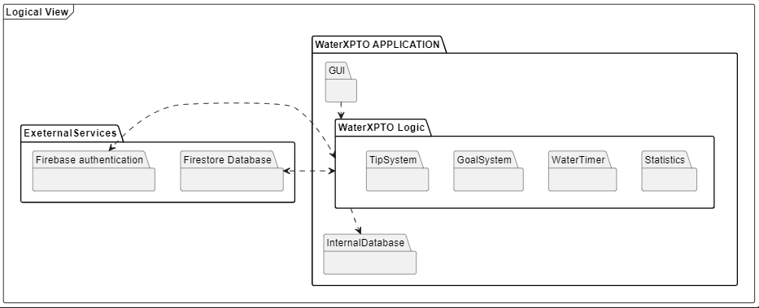
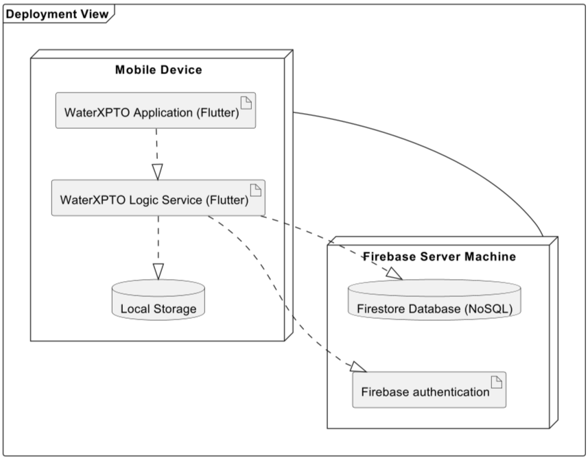

# _WaterXPTO_ Development Report

Welcome to the documentation pages of the _WaterXPTO_!

You can find here details about the _WaterXPTO_, from a high-level vision to low-level implementation decisions, a kind of Software Development Report, organized by type of activities: 

* [Business modeling](#Business-Modelling) 
  * [Product Vision](#Product-Vision)
  * [Features and Assumptions](#Features-and-Assumptions)
  * [Elevator Pitch](#Elevator-pitch)
* [Requirements](#Requirements)
  * [User stories](#User-stories)
  * [Domain model](#Domain-model)
* [Architecture and Design](#Architecture-And-Design)
  * [Logical architecture](#Logical-Architecture)
  * [Physical architecture](#Physical-Architecture)
  * [Vertical prototype](#Vertical-Prototype)
* [Project management](#Project-Management)

Please contact us!

Thank you!

### Team Members
- Duarte Ribeiro Lagoela - up202205629@up.pt
- Gonçalo Joaquim Vale Remelhe - up202205318@up.pt
- José António Santos Costa - up202004823@up.pt
- Rafael Costa Pires - up202208602@up.pt
- Sara Isabel Borges da Silva - up202007248@up.pt

---
## Business Modelling

### Product Vision

For environmentally conscious individuals who aim for a sustainable lifestyle. WaterXPTO provides real-time monitoring, personalized insights, and actionable tips to reduce water consumption effortlessly. Track usage, receive tailored recommendations, and contribute to global conservation efforts with WaterXPTO.

### Features and Assumptions

#### Real-time Water Usage Tracking:
- Enable users to input and track their water usage data manually (via timer).

#### Personalized Water Usage Insights:
- Analyze users' water consumption patterns to provide personalized insights (potential areas for improvement).
- Display daily, weekly, and monthly usage history and trends in an easy-to-understand graphical format.

#### Water Saving Tips and Recommendations:

- Offer a library of water-saving tips and recommendations (based on users' usage patterns) (daily tips notification).

#### Notifications and Reminders:

- Send push notifications and reminders to users based on their water usage habits and conservation goals (timers when showring, washing dishes ...).
- Allow users to customize notification settings based on their preferences.

#### Water Conservation Challenges:

- Create challenges and competitions within the app to motivate users to save water.
- Allow users to join challenges, track their progress, and compete with friends or other users.

#### Feedback and Reporting:

- Implement a feedback mechanism within the app for users to submit suggestions, report issues, and provide overall feedback on their experience.

### Elevator Pitch
Draft a small text to help you quickly introduce and describe your product in a short time (lift travel time ~90 seconds) and a few words (~800 characters), a technique usually known as elevator pitch.

Take a look at the following links to learn some techniques:
* [Crafting an Elevator Pitch](https://www.mindtools.com/pages/article/elevator-pitch.htm)
* [The Best Elevator Pitch Examples, Templates, and Tactics - A Guide to Writing an Unforgettable Elevator Speech, by strategypeak.com](https://strategypeak.com/elevator-pitch-examples/)
* [Top 7 Killer Elevator Pitch Examples, by toggl.com](https://blog.toggl.com/elevator-pitch-examples/)

## Requirements

### User stories

- `As a User`, `I want` to track my daily water usage in real-time `so that` I can become more aware of my consumption habits and make informed decisions to reduce waste.

- `As a User`, `I want` to receive a statistical analysis about my water consumption patterns, `so that` I can improve my water consumption habits.

- `As a User`, `I want` to set personalized water usage goals and targets and receive notifications when I meet or exceed these targets, `so that` I can stay motivated to save water.

- `As a User`, `I want` to receive tips and recommendations for reducing water consumption in various areas of my daily life, `so that` I can learn new methods to reduce my water consumption.

- `As a User`, `I want` to receive notifications and reminders to take shorter showers, and perform other water-saving actions, `so that` I can stay on track with my conservation efforts.

- `As a Registered User`, `I want` to participate in water conservation challenges with friends and other users `so that` we can motivate each other and celebrate our collective efforts in saving water.

- `As a User`, `I want` to compare my water usage with regional or national averages `so that` I understand how my consumption habits compare to others and gain motivation to further reduce my environmental impact.

- `As an Unregistered User`, `I want` to be able to have access to most of the app’s features `so that` I don’t have to login.

- `As an Unregistered User`, `I want` to be able to create an account `so that` I can keep data on multiple devices.

### Domain Model

Each user can set as many personal goals as he wants and receive different tips.
Also, a user can register an activity and time its duration and the user should insert his data in order to receive personalized statistics such as a region and a nationality.

## Architecture and Design
The architecture of a software system encompasses the set of key decisions about its overall organization. 

A well written architecture document is brief but reduces the amount of time it takes new programmers to a project to understand the code to feel able to make modifications and enhancements.

To document the architecture requires describing the decomposition of the system in their parts (high-level components) and the key behaviors and collaborations between them. 

In this section you should start by briefly describing the overall components of the project and their interrelations. You should also describe how you solved typical problems you may have encountered, pointing to well-known architectural and design patterns, if applicable.

### Logical architecture

The main focus of the Logical Architecture is to represent the various layers/packages that belong to our app.

Our application (WaterXPTO) contains the majority of the functionalities. It is divided in three subsections: `GUI` (`G`raphical `U`ser `I`nterface), the application's `Logic` and the WaterXPTO `Database`, which contains data storage. Inside the `Logic` package there are more sections: `TipSystem`, `WaterTimer`, `Statistics` and `GoalSystem`. Their responsibility is managing the application tips, the duration of an activity, data manipulation and goal's management, respectively.

The External Services includes the dependencies in our app, in this case, `Firestore` and `Firebase`.

### Physical architecture

Following the Logical Architecture, with the same dependencies we can elaborate an Physical Architecture represented in a Deployment Diagram. The dependencies used were Firebase (used for authentication) and Firestore (used for storage).

### Vertical prototype

At the moment, we have partially implemented some features and some pages, such the login screen and the main menu. In the login screen, the user can choose between inserting his data or skip the login phase if the user do not have an account. The main menu has the buttons for the water activities. However, for now these buttons are functionless.

## Project management

### Sprint 1

#### Begin

#### End

#### What went well?
- We were able to successfully implement notifications with Background Services.
- We were able to make an interface similar to the mockups.
- We were able to implement the timer for the activities.

#### What went wrong?
- We were not expecting one of the members to leave the group.
- We were not able to implement all the features we wanted to.
- It took us a while to compile the project in different devices.

#### What will we do differently next time?
- We will try to implement the features we want to earlier.

#### How satisfied are we with the progress?
- We are satisfied with the progress we made, but we could have done more.

#### Completed user stories
- [As a User, I want to receive a statistical analysis about my water consumption patterns, so that I can improve my water consumption habits.](https://github.com/orgs/FEUP-LEIC-ES-2023-24/projects/37/views/1?pane=issue&itemId=56479404)
- [As a User, I want to receive tips and recommendations for reducing water consumption in various areas of my daily life, so that I can learn new methods to reduce my water consumption.](https://github.com/orgs/FEUP-LEIC-ES-2023-24/projects/37/views/1?pane=issue&itemId=60075788)
- [As a User, I want to receive notifications and reminders to take shorter showers, and perform other water-saving actions, so that I can stay on track with my conservation efforts.](https://github.com/orgs/FEUP-LEIC-ES-2023-24/projects/37/views/1?pane=issue&itemId=56479564)

### Sprint 2

#### Begin

